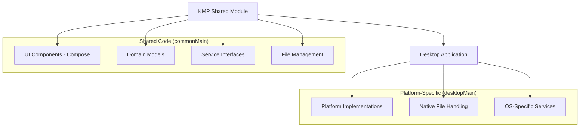

# MotionCut

A video trimming application built with Kotlin Multiplatform (KMP) for desktop platforms. Currently in early development with basic video playback functionality.

## 🎯 Project Overview

MotionCut is a desktop video editing application focused on intelligent video trimming. The project follows an incremental development approach, starting with basic video playback and gradually adding advanced features like AI-powered motion detection.

**Current Status**: Basic video player with file handling - Phase 1 of development

## 🏗️ Architecture



## 🚀 Current Features

### ✅ Implemented
- **Project Structure**: KMP setup with proper commonMain/desktopMain organization
- **Basic UI**: Compose Desktop application with main screen
- **File Handling**: Drag & drop interface for video files
- **Domain Models**: Basic video file representation
- **Platform Detection**: OS information and platform-specific providers

### 🚧 In Development
- **Video Playback**: Frame-by-frame video rendering (current focus)
- **Timeline Controls**: Basic playback controls and scrubbing
- **Video Processing**: Core trimming functionality

### 📋 Planned Features
- **Motion Detection**: AI-powered person tracking (Phase 3)
- **Smart Trimming**: Automatic segment identification
- **Batch Processing**: Multiple video handling
- **Export Options**: Various formats and quality settings

## 🛠️ Technology Stack

### Core Technologies
- **Kotlin Multiplatform (KMP)**: Cross-platform development
- **Compose Desktop**: Modern, declarative UI framework
- **JavaCV/FFmpeg**: Video processing (planned integration)

### Future ML Integration (Phase 3)
- **ONNX Runtime**: ML model inference
- **Person Detection**: YOLO or MediaPipe models
- **Motion Analysis**: Optical flow algorithms

## 📋 Development Phases

### Phase 1: Basic Video Player ✅ (Current)
**Timeline**: 4-6 weeks (including learning curve)

**Objectives:**
- ✅ Set up KMP project structure
- ✅ Implement basic UI with Compose Desktop
- ✅ Add drag & drop file handling
- 🚧 Create video playback functionality
- 🚧 Add timeline controls

**Current Implementation:**
```kotlin
// Implemented components
✅ VideoFile.kt - Domain model
✅ MainScreen.kt - Main UI
✅ DragAndDropHandler.kt - File handling
✅ OSInfo.kt - Platform detection
🚧 VideoPlayer.kt - Video playback (in progress)
```

### Phase 2: Basic Trimming (Next)
**Timeline**: 4-5 weeks (realistic estimate based on Phase 1 experience)

**Objectives:**
- Implement video trimming functionality
- Add export capabilities
- Create timeline editing interface
- Basic video processing pipeline

### Phase 3: AI Integration (Future)
**Timeline**: 8-12 weeks (complex cross-platform ML integration)

**Objectives:**
- Integrate ML models for person detection
- Implement motion-based trimming
- Add batch processing capabilities
- Performance optimization

## 🔧 Development Setup

### Prerequisites
- **JDK 21+**: For Kotlin/JVM development
- **Kotlin 2.1.21**: Latest Kotlin version
- **Gradle 8.11+**: Build system

### Platform-Specific Build Requirements

⚠️ **Important**: Cross-compilation limitations
- Windows executables (.msi) can only be built on Windows
- macOS executables (.dmg) can only be built on macOS  
- Linux executables (.deb) can only be built on Linux

### Building for Windows from macOS
This is **not possible**. You must use:
- Windows machine or VM
- GitHub Actions with Windows runners
- Cloud build services

### Project Setup
```bash
# Clone the repository
git clone <repository-url>
cd motioncut

# Build the project
./gradlew build

# Run on desktop
./gradlew run
```

## 📁 Current Project Structure

```
motioncut/
├── src/
│   ├── commonMain/kotlin/com/yanbin/motioncut/
│   │   ├── domain/
│   │   │   └── VideoFile.kt               # Video file domain model ✅
│   │   ├── platform/
│   │   │   ├── DragAndDropHandler.kt      # Cross-platform interface ✅
│   │   │   └── OSInfo.kt                  # Platform information ✅
│   │   ├── services/
│   │   │   └── VideoTrimmerService.kt     # Service interface ✅
│   │   └── ui/
│   │       ├── MainScreen.kt              # Main application UI ✅
│   │       ├── SystemInfoScreen.kt        # System information ✅
│   │       ├── VideoPlayerWithTrimming.kt # Video player wrapper ✅
│   │       ├── components/
│   │       │   ├── FileDropZone.kt        # File drop zone ✅
│   │       │   └── VideoPlayer.kt         # Video playback 🚧
│   │       ├── video/
│   │       │   ├── VideoPlayer.kt         # Video components 🚧
│   │       │   ├── VideoPlayerWithTrimming.kt
│   │       │   └── VideoSurface.kt
│   │       └── widget/
│   │           └── Icon.kt                # UI widgets ✅
│   └── desktopMain/kotlin/
│       ├── Main.kt                        # Desktop entry point ✅
│       ├── platform/
│       │   ├── DragAndDropHandler.kt      # Desktop implementation ✅
│       │   ├── OSInfo.kt                  # Platform info ✅
│       │   └── PlatformProviders.kt       # Platform providers ✅
│       ├── services/
│       │   └── VideoTrimmerService.kt     # Desktop service impl ✅
│       └── ui/
│           └── video/
│               └── VideoSurface.kt        # Desktop video surface 🚧
├── build.gradle.kts                       # Build configuration ✅
├── settings.gradle.kts                    # Project settings ✅
└── developNote/                           # Development documentation ✅
    ├── note1.md                          # Development notes
    └── retro for note1.md                # Retrospective analysis
```

**Legend**: ✅ Implemented | 🚧 In Progress | ❌ Not Started

## 🎥 Video Rendering Implementation

### Current Approach: Frame-by-Frame Rendering
- **Method**: Extract individual frames and render as images
- **Performance**: Suitable for analysis but not optimal for playback
- **Rationale**: Enables frame-level analysis for future motion detection
- **Limitations**: Higher memory usage, not suitable for real-time playback

### Alternative Approaches Considered
- Native video players: Not suitable for editing applications
- Java video libraries: Cross-platform compatibility issues
- Hardware acceleration: Future enhancement

## 🤖 Working with AI Assistants

### Best Practices Learned
1. **Start Simple**: Always insist on minimal implementations first
2. **Verify Platform Claims**: Don't trust AI about platform-specific capabilities
3. **Maintain Architecture Control**: Be explicit about code organization
4. **Question Performance Suggestions**: Evaluate efficiency implications
5. **Incremental Development**: Resist AI's tendency to over-engineer

### Common AI Assistant Pitfalls
- Over-engineering simple requirements
- Incorrect platform-specific assumptions
- Poor understanding of KMP architecture boundaries
- Overconfidence in unverified solutions

## 📈 Realistic Development Timeline

### Phase 1: Basic Video Player (Current)
- **Original Estimate**: 2-3 weeks
- **Actual Experience**: 4-6 weeks (including AI collaboration challenges)
- **Challenges**: Cross-platform video rendering, build system setup

### Phase 2: Basic Trimming
- **Estimated**: 2-3 weeks  
- **Realistic**: 4-5 weeks (based on Phase 1 experience)

### Phase 3: ML Integration
- **Original Estimate**: 3-4 weeks
- **Realistic Estimate**: 8-12 weeks (complex cross-platform ML integration)

## 📦 Deployment

### Current Distribution
- **Development**: Run via Gradle
- **Platform Limitations**: Cannot cross-compile between platforms

### Future Distribution Plans
- Platform-specific installers
- Bundled ML models (when implemented)
- Auto-update mechanism

## 🤝 Contributing

### Development Workflow
1. Fork the repository
2. Create a feature branch
3. Implement changes incrementally
4. Test on target platform
5. Submit pull request with detailed description

### Code Organization Guidelines
- **commonMain**: UI components, business logic, interfaces
- **desktopMain**: Platform implementations, native integrations
- Follow established patterns in existing code
- Document architectural decisions

## 📄 License

This project is licensed under the MIT License - see the [LICENSE](LICENSE) file for details.

## 🔗 Resources

### Documentation
- [Kotlin Multiplatform Guide](https://kotlinlang.org/docs/multiplatform.html)
- [Compose Desktop Documentation](https://github.com/JetBrains/compose-multiplatform)

### Development Notes
- [`developNote/note1.md`](developNote/note1.md) - Initial development experience
- [`developNote/retro for note1.md`](developNote/retro%20for%20note1.md) - Project analysis and lessons learned

---

**Built with ❤️ using Kotlin Multiplatform**

*This README reflects the actual current state of the project and is updated incrementally as features are implemented.*