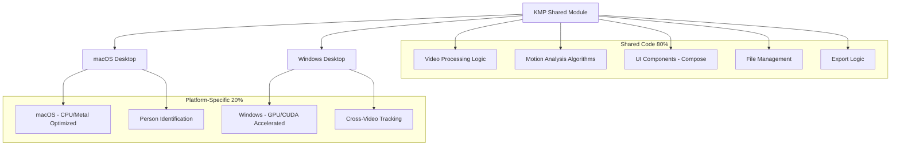
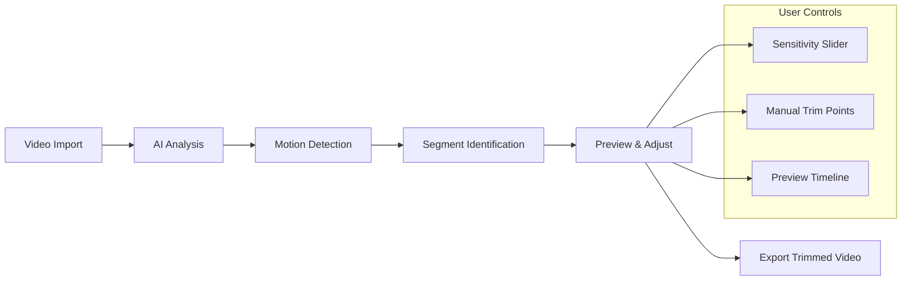

# AI-Powered Video Trimmer

An intelligent video trimming application built with Kotlin Multiplatform (KMP) that uses machine learning to automatically detect and track people in videos, enabling smart video editing across macOS and Windows platforms.

## 🎯 Project Overview

This application leverages ML-based person detection and motion tracking to automatically trim videos, keeping only segments with active human movement. The app is designed to work efficiently on both macOS (for development and quick previews) and Windows (for GPU-accelerated production processing).

## 🏗️ Architecture



## 🚀 Key Features

### Core Functionality
- **Drag & Drop Video Import**: Easy video file handling
- **Real-time Video Playback**: Preview videos with timeline scrubbing
- **AI-Powered Person Detection**: Automatic person tracking using ML models
- **Motion-Based Trimming**: Keep only segments with active movement
- **Cross-Platform Support**: Optimized for both macOS and Windows
- **GPU Acceleration**: Leverage NVIDIA RTX 3070 Ti on Windows

### Advanced Features
- **Person Identification**: Track specific individuals across multiple videos
- **Batch Processing**: Process multiple videos simultaneously
- **Custom Thresholds**: Adjustable motion sensitivity
- **Export Options**: Multiple formats and quality settings
- **Timeline Editor**: Manual trim adjustments

## 🛠️ Technology Stack

### Core Technologies
- **Kotlin Multiplatform (KMP)**: Cross-platform development
- **Compose Desktop**: Modern, declarative UI framework
- **ONNX Runtime**: ML model inference with GPU acceleration
- **JavaCV (OpenCV)**: Video processing and computer vision
- **FFmpeg**: Video encoding/decoding

### ML & Computer Vision
- **Person Detection**: YOLO, MediaPipe, or custom models
- **Pose Estimation**: Track body keypoints for motion analysis
- **Face Recognition**: For person identification across videos
- **Motion Analysis**: Optical flow and temporal tracking

### Platform-Specific Optimizations
- **macOS**: Metal Performance Shaders, CPU optimization
- **Windows**: CUDA acceleration, TensorRT optimization

## 📋 Development Milestones

### Milestone 1: Foundation & Basic Video Handling
**Timeline: 2-3 weeks**

**Objectives:**
- Set up KMP project structure for macOS and Windows
- Implement drag & drop video interface
- Add video playback functionality with timeline controls
- Basic file management and export capabilities

**Deliverables:**
- [ ] KMP project setup with Compose Desktop
- [ ] Cross-platform video player component
- [ ] Drag & drop file handling
- [ ] Timeline scrubbing and playback controls
- [ ] Basic video export functionality

**Technical Tasks:**
```kotlin
// Core components to implement
- VideoPlayer composable
- TimelineController
- FileDropHandler
- VideoExporter
- Platform-specific video codecs
```

### Milestone 2: ML Model Integration & Cross-Platform Inference
**Timeline: 3-4 weeks**

**Objectives:**
- Integrate person detection models
- Implement motion tracking algorithms
- Verify model performance on both platforms
- Optimize for platform-specific acceleration

**Deliverables:**
- [ ] ONNX Runtime integration
- [ ] Person detection model (YOLO/MediaPipe)
- [ ] Motion analysis algorithms
- [ ] Platform-specific GPU acceleration
- [ ] Performance benchmarking tools

**Technical Implementation:**
```kotlin
// ML Pipeline Architecture
expect class PersonTracker {
    fun detectPerson(frame: VideoFrame): BoundingBox?
    fun trackMotion(frames: List<VideoFrame>): MotionData
}

// Platform-specific implementations
actual class PersonTracker {
    // macOS: Metal/CPU optimized
    // Windows: CUDA/TensorRT accelerated
}
```

**Model Testing Strategy:**
- Test different model architectures (YOLO v8, MediaPipe, custom models)
- Benchmark inference speed on both platforms
- Validate accuracy across different video types
- Optimize memory usage and batch processing

### Milestone 3: Intelligent Video Trimming & Export
**Timeline: 3-4 weeks**

**Objectives:**
- Build complete trimming workflow
- Implement motion-based segment selection
- Create intuitive UI for trim preview and adjustment
- Add batch processing capabilities

**Deliverables:**
- [ ] Motion analysis and threshold detection
- [ ] Automatic segment identification
- [ ] Trim preview with timeline visualization
- [ ] Batch video processing
- [ ] Multiple export formats and quality options

**UI Flow:**


**Core Features:**
- Real-time motion visualization on timeline
- Adjustable motion sensitivity thresholds
- Manual override for trim points
- Progress tracking for batch operations
- Quality presets for different use cases

### Milestone 4: Person Identification & Cross-Video Tracking
**Timeline: 4-5 weeks**

**Objectives:**
- Implement face recognition for person identification
- Enable tracking the same person across multiple videos
- Build person management interface
- Add advanced filtering and search capabilities

**Deliverables:**
- [ ] Face recognition model integration
- [ ] Person database and management
- [ ] Cross-video person tracking
- [ ] Advanced filtering UI
- [ ] Person-specific trim profiles

**Advanced Features:**
```kotlin
// Person identification system
class PersonIdentifier {
    fun identifyPerson(face: FaceEmbedding): PersonID?
    fun registerNewPerson(faces: List<FaceEmbedding>): PersonID
    fun trackPersonAcrossVideos(personID: PersonID, videos: List<Video>): List<PersonSegment>
}

// Cross-video workflow
class CrossVideoProcessor {
    fun findPersonInVideos(personID: PersonID): Map<Video, List<TimeSegment>>
    fun createPersonHighlightReel(personID: PersonID): Video
    fun batchProcessPersonVideos(personID: PersonID, settings: TrimSettings)
}
```

**UI Enhancements:**
- Person gallery with thumbnail previews
- Search and filter by person
- Bulk operations for person-specific content
- Timeline view showing person appearances across videos

## 🔧 Development Setup

### Prerequisites
- **JDK 21+**: For Kotlin/JVM development
- **Kotlin 2.1.21**: Latest Kotlin version
- **Gradle 8.11+**: Build system

### Platform-Specific Requirements

#### macOS Development
```bash
# Install Xcode Command Line Tools
xcode-select --install

# Install Homebrew (if not already installed)
/bin/bash -c "$(curl -fsSL https://raw.githubusercontent.com/Homebrew/install/HEAD/install.sh)"

# Install required dependencies
brew install ffmpeg
```

#### Windows Production
```bash
# Install NVIDIA CUDA Toolkit
# Download from: https://developer.nvidia.com/cuda-downloads

# Install cuDNN
# Download from: https://developer.nvidia.com/cudnn

# Install Visual Studio Build Tools
# Download from: https://visualstudio.microsoft.com/downloads/
```

### Project Setup
```bash
# Clone the repository
git clone <repository-url>
cd video-trimmer-kmp

# Build the project
./gradlew build

# Run on desktop
./gradlew :desktop:run
```

## 📁 Project Structure

```
video-trimmer-kmp/
├── shared/
│   ├── src/commonMain/kotlin/
│   │   ├── domain/
│   │   │   ├── VideoProcessor.kt           # Core video processing
│   │   │   ├── PersonTracker.kt            # ML tracking interface
│   │   │   ├── MotionAnalyzer.kt          # Motion detection algorithms
│   │   │   └── PersonIdentifier.kt        # Face recognition
│   │   ├── ui/
│   │   │   ├── MainScreen.kt              # Main application UI
│   │   │   ├── VideoPlayer.kt             # Video playback component
│   │   │   ├── Timeline.kt                # Timeline and scrubbing
│   │   │   ├── PersonGallery.kt           # Person management UI
│   │   │   └── ExportDialog.kt            # Export configuration
│   │   └── utils/
│   │       ├── VideoUtils.kt              # Video utilities
│   │       ├── FileUtils.kt               # File operations
│   │       └── MathUtils.kt               # Mathematical operations
│   ├── src/jvmMain/kotlin/
│   │   ├── platform/
│   │   │   ├── PlatformDetector.kt        # OS and hardware detection
│   │   │   └── GPUDetector.kt             # GPU capability detection
│   │   └── ml/
│   │       ├── ONNXTracker.kt             # ONNX Runtime implementation
│   │       ├── CPUTracker.kt              # CPU-optimized inference
│   │       └── ModelManager.kt            # Model loading and caching
│   └── src/
│       ├── macosMain/kotlin/
│       │   ├── platform/MacOSTracker.kt   # Metal-optimized tracking
│       │   └── video/MacOSProcessor.kt    # macOS video processing
│       └── windowsMain/kotlin/
│           ├── platform/WindowsTracker.kt # CUDA-optimized tracking
│           └── video/WindowsProcessor.kt  # Windows video processing
├── desktop/
│   └── src/jvmMain/kotlin/
│       ├── Main.kt                        # Application entry point
│       └── DesktopApp.kt                  # Desktop-specific setup
├── models/                                # Pre-trained ML models
│   ├── person_detection.onnx
│   ├── pose_estimation.onnx
│   └── face_recognition.onnx
├── docs/                                  # Documentation
│   ├── API.md
│   ├── ARCHITECTURE.md
│   └── DEPLOYMENT.md
└── gradle/
    └── libs.versions.toml                 # Dependency management
```

## ⚡ Performance Optimization

### macOS (Development Platform)
- **Processing Mode**: Preview/Development
- **Resolution**: 720p for quick iteration
- **Acceleration**: Metal Performance Shaders when available
- **Memory Usage**: 2-4GB RAM
- **Use Case**: Quick prototyping, UI development, algorithm testing

### Windows (Production Platform)
- **Processing Mode**: Full production quality
- **Resolution**: Up to 4K with full quality
- **Acceleration**: CUDA + TensorRT on RTX 3070 Ti
- **Memory Usage**: 6-8GB VRAM + 4-8GB RAM
- **Use Case**: Final video production, batch processing

### Performance Expectations
| Platform | Video Resolution | Processing Speed | Memory Usage |
|----------|------------------|------------------|--------------|
| macOS    | 720p            | 15-30 FPS        | 2-4GB RAM    |
| macOS    | 1080p           | 8-15 FPS         | 3-6GB RAM    |
| Windows  | 1080p           | 60+ FPS          | 4GB VRAM     |
| Windows  | 4K              | 15-30 FPS        | 6-8GB VRAM   |

## 🧪 Testing Strategy

### Unit Tests
- Video processing algorithms
- Motion detection accuracy
- Person identification precision
- Cross-platform compatibility

### Integration Tests
- End-to-end video processing pipeline
- ML model inference on both platforms
- File I/O and export functionality
- UI component interactions

### Performance Tests
- GPU utilization benchmarks
- Memory usage profiling
- Processing speed measurements
- Batch operation efficiency

## 📦 Deployment

### Distribution Strategy
- **Single JAR**: Cross-platform executable with runtime platform detection
- **Platform-Specific Optimizations**: Automatic GPU acceleration detection
- **Model Bundling**: Include pre-trained models in distribution
- **Auto-Updates**: Built-in update mechanism for models and application

### System Requirements

#### Minimum Requirements
- **OS**: macOS 10.15+ or Windows 10+
- **RAM**: 8GB
- **Storage**: 2GB free space
- **CPU**: Intel i5 or AMD Ryzen 5 equivalent

#### Recommended Requirements
- **OS**: macOS 12+ or Windows 11+
- **RAM**: 16GB+
- **Storage**: 10GB free space
- **GPU**: NVIDIA RTX 3060+ (Windows) or Apple Silicon (macOS)
- **CPU**: Intel i7 or AMD Ryzen 7 equivalent

## 🤝 Contributing

### Development Workflow
1. Fork the repository
2. Create a feature branch
3. Implement changes with tests
4. Submit pull request with detailed description

### Code Style
- Follow Kotlin coding conventions
- Use meaningful variable and function names
- Add comprehensive documentation for public APIs
- Include unit tests for new functionality

## 📄 License

This project is licensed under the MIT License - see the [LICENSE](LICENSE) file for details.

## 🔗 Resources

### Documentation
- [Kotlin Multiplatform Guide](https://kotlinlang.org/docs/multiplatform.html)
- [Compose Desktop Documentation](https://github.com/JetBrains/compose-multiplatform)
- [ONNX Runtime Documentation](https://onnxruntime.ai/docs/)
- [JavaCV Documentation](https://github.com/bytedeco/javacv)

### ML Models
- [YOLO Models](https://github.com/ultralytics/ultralytics)
- [MediaPipe Solutions](https://developers.google.com/mediapipe)
- [ONNX Model Zoo](https://github.com/onnx/models)

### Performance Optimization
- [NVIDIA TensorRT](https://developer.nvidia.com/tensorrt)
- [Apple Metal Performance Shaders](https://developer.apple.com/metal/)
- [CUDA Programming Guide](https://docs.nvidia.com/cuda/)

---

**Built with ❤️ using Kotlin Multiplatform**